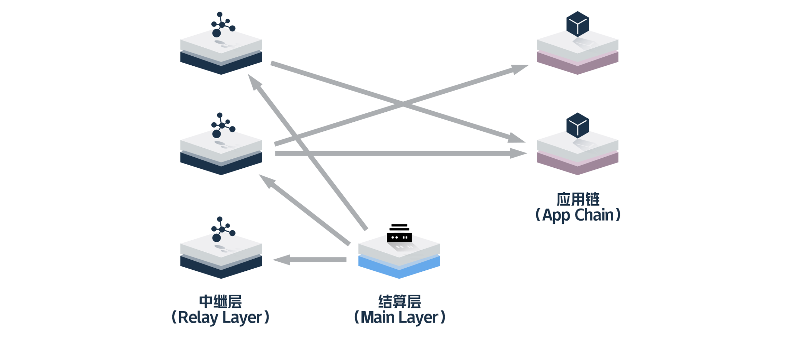
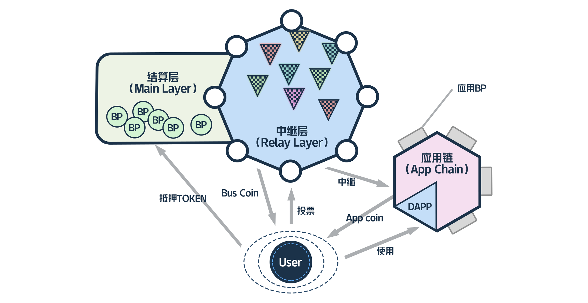
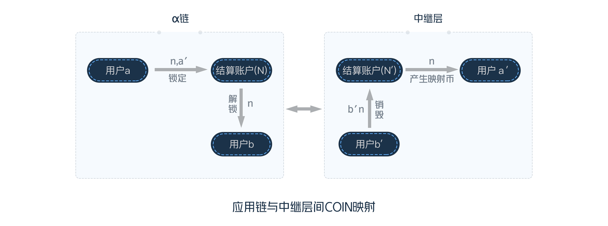
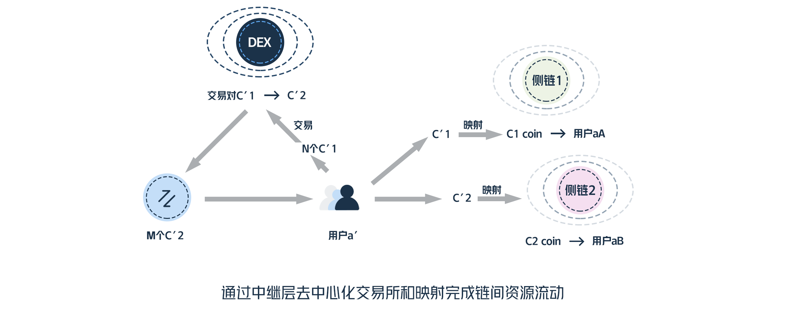
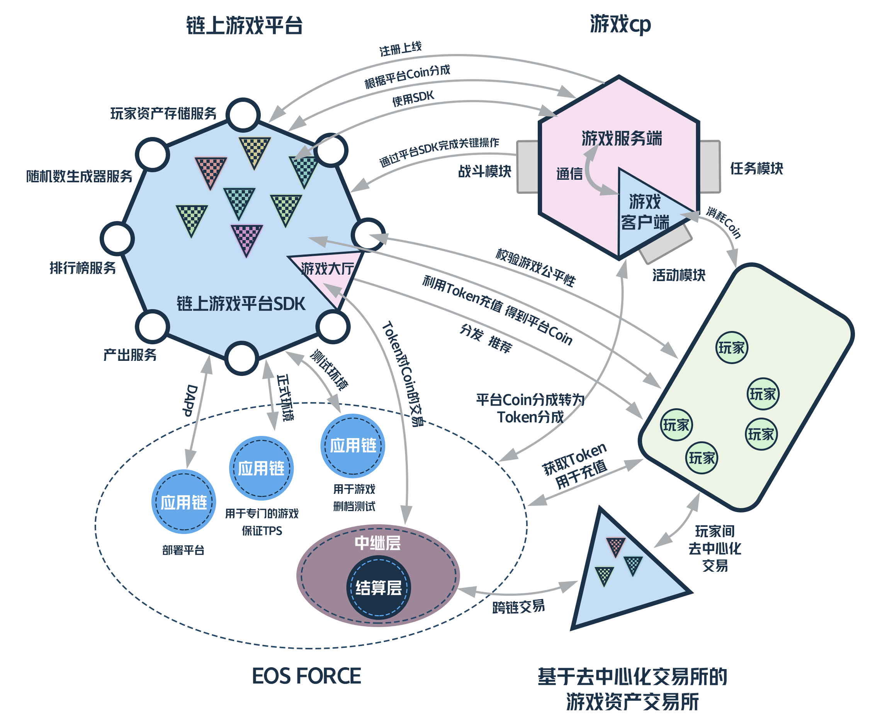

# Eosforce多链架构技术规划

------------------------

## 1. 介绍

支持多链是Eosforce的一个重要的开发方向，通过多链我们可以在兼顾当前链安全的同时，为用户和DApp开发者提供丰富的功能，另外一方面，通过跨链可以允许社区启动不同的公链或私链，为DApp提供最适合的运行环境。

### 1.1 问题

Eosforce对EOS项目作出了很多修改，其重要的原因之一就是为了保障链运行的稳定性和安全性，为此，Eosforce选择了先以最小的功能启动，
但是这也意味着DApp开发者在初期无法自由的部署智能合约，考虑到现在EOS开发尚不完善，所以贸然放开功能会带来很多问题，影响整个链的安全性，
同时，不同的应用和交易对于安全性的要求并不相同，从架构角度看，将所有的交易和合约都放在一起执行并不是良好的设计。

目前几乎所有区块链项目都面临DApp运营成本过高的问题，EOS通过使用BFT-DPOS使整个链有很高TPS，但是对于超级节点，很多资源在一定时间内依旧是有限的，如RAM，虽然依照摩尔定律，随着时间的推移，整个链会得到更多的资源，但是相对于DApp旺盛且快速增长的需求，短期内很大程度上会出现资源的相对稀缺，加上某些炒作行为的推动，会严重加大开发者的运营成本，这对于整个EOS发展是个很大的阻碍。

基于以上以及安全性方面的考虑，我们选择在最小功能的链上作结算，同时在多链上部署DApp，这样即为开发者和用户提供丰富的功能又能保证用户资产的安全性，同时我们可以确保全网资源都可以增长，使得资源的稀缺性得到缓解，DApp开发者可以自由选择可以负担成本的多链，这样可以保持整个链的活力。

### 1.2 前人工作

为了解决比特币安全升级的问题，比特币核心开发者提出了侧链技术，2014年，Blockstream发布了 Enabling Blockchain Innovations with Pegged Sidechains，提出利用双向挂钩(Two-way Peg)， 使得比特币可以在结算层和侧链中互转，在此之上可以允许用户访问众多新服务，通过比特币区块链，为用户提供更快的交易速度与智能合约.

在侧链技术的基础上，Cosmos试图构建一个全新的去中心化与可扩展性模型，Cosmos网络通过Tendermint机制来运行众多区块链。Cosmos提出了空间(Zone)的概念，每一条链视为一个空间，网络中的第一条链称之为Cosmos中心(Hub Zone)，使用其实现不同空间间的通信(IBC)。

波卡链(Polkadot)是由Gavin Wood博士提出的另一个极具前景的多链技术，Polkadot构建了一个可伸缩的异构多链系统，通过提供基础的中继层，其他链如比特币，以太坊等可以接入Polkadot。

### 1.3 目标

我们希望在前人的基础上，为Eosforce基于EOS所带来的优秀的共识机制设计一套异构多链体系，我们希望这个多链系统形成一个生态，为我们带来以下好处：

**稳定而廉价的链上资源** 开发者可以根据自身需求自由选择运行的侧链，允许多个侧链接入整个生态，会使得资源的供给可以充分满足市场的需求，
这样可以稳定链上资源的成本，另一方面，很多应用会希望链上可以提供稳定的资源和TPS，通过部署专门的侧链，可以充分保证DApp运行不会被其他应用干扰。

**允许扩展链功能** 某些时候开发者和用户需要扩展链功能以实现其特殊的需求，进而部署专门的联盟链或者私链以侧链加入Eosforce。

**多链间价值交换** 多链系统中通过中继层，可以很方便的交换多个链上的资产，进一步，可以在中继层上部署去中心化的交易所。

**支持无缝迁移基于其他链的应用** 我们可以引入其他底层链技术和智能合约技术，以侧链的形式提供给开发者和用户，这样开发者可以很方便的移植已有的应用到Eosforce生态中。

## 2. 链架构

我们定义三种结构：结算层，中继层和侧链。

**结算层(Main Layer)**  我们把现有的Eosforce链称为结算层，目前在结算层上，我们暂时没有开放智能合约，仅提供Token结算等几个有限的功能。

**中继层(Relay Layer)** 结算层与中继层连接，中继层类似于Cosmos中心(Hub Zone)，为连接中继层的侧链提供与结算层的通信的能力，
同时，中继层也可以为其连接的侧链间提供通信功能.

**侧链(App Chain)** 侧链可以部署应用，开发者可以根据需求自由选择侧链。

## 3. 设计综述

EOS全称Enterprise Operation System，从操作系统的角度来看，其最重要的一部分就是用户以及用户权限系统，对于用户来说，Token可以看作用户在EOS中权利的量化表现，而Eosforce中结算层的职责即为维护用户权利，结算层与侧链之间最主要的联系即结算主链向侧链的授权行为，表现即为结算层上的Token和侧链上的Token的双向转换。

这类似于传统操作系统中的用户系统，传统的操作系统通过这一机制，使得其所管理的进程获得其所需要的权限，同时通过权限的区分，可以有效的保证整个系统的安全性。相应的，在EOS生态中，我们通过建立一套结算层与侧链之间的授权机制，使得用户可以在不同侧链上使用DApp的同时保证整个系统的安全性。

为了实现主侧链间的授权，我们引入一个独立的中继层，使得我们可以去中心化的实现Token的双向转换。

之所以要引入中继层，有以下几方面考虑：

- 首先，我们的核心诉求就是保证结算层的功能最精简化以获取最大的安全性，我们结算主链之上只支持结算。
- 其次，对于用户的跨链需求，我们需要一个中立的中继层来处理链之间的交互。
- 再次，通过中继层进行侧链的治理，我们可以让侧链的提供者可以自由的提供侧链，另一方面，又可以在侧链出现问题时，对侧链进行有效的处理。

## 4. 多链生态

通过多链我们可以构建一个充分自由的链上生态，服务提供者可以自由的提供不同种类的服务，用户也可以自由的选择服务。通过构建一个资源的自由市场，我们可以实现很多以往很难实现的应用场景。

### 4.1 角色

**主链** 主链包括结算层与中继层，结算层作为基础的结算层，主节点通过出块，即提供计算资源，获取token奖励，另一方面，用户通过投票可以保证主节点的诚实。中继层拥有链上资产去中心化交易所，其上可以自由交易链上对应的资产。

**侧链节点** 即侧链上的超级节点，当然我们的多链架构中允许异构链作为侧链，只要其满足与中继层的协议，这意味应用节点不一定是EOS超级节点，
也可以是一条私链或者联盟链。应用节点主要提供计算资源，侧链发布其上的coin给用户和应用服务者，另一方面，用户和应用服务者持有coin来使用侧链上的计算资源。

很多时候应用服务者可以自身作为应用节点来为自己的用户和应用提供免费的计算资源，也可以选择使用其他应用节点提供的资源，这样一个自由供给和消费的市场可以有效的解决应用服务者的需求。

**用户** 用户持有Token，一般实现中，用户可以通过中继层可以在结算层上抵押Token，进而在侧链上获取Coin，另一方面，用户可以在侧链上锁定Coin，进而在结算层上获得Token。
当然侧链与应用服务者可以自由的发布Coin，这些Coin可以通过中继层跨链结算，通过其他方式让用户兑换或者交易。

**应用服务者** 应用服务者可以在侧链上部署DApp，应用服务者可以自由选择部署的侧链，也可以自行架设侧链。

### 4.2 中继层去中心化交易所

为了不同链上coin可以自由的交易，我们在中继层上建立去中心化交易所。

中继层作为其下侧链的一个中心，一方面，中继层可以作为中继实现两个链中的资产挂钩，另一方面，作为一个第三方，其也可以通过将其他链上的coin挂钩到中继层上对应的coin，我们在中继层上建立各个侧链coin间的去中心化交易所，可以实现各个侧链上资产的流转。

### 4.3 链上治理

中继层对侧链进行监管，对于第三方的侧链，当侧链出现问题时，中继层可以发起中继节点投票，来锁定侧链与结算层的通信，避免侧链故障造成更大影响。

## 5. Token体系

在Eosforce生态中，Token代表用户的权利，用户使用Token在不同的链上交易或者使用资源。

所有的服务提供者，包括应用节点和应用服务者，可以发行对应链上的Coin来为用户赋予使用服务的权利，用户可以在中继层上建立不同侧链上的Coin的映射，同时可以在中继层上的去中心化交易所建立映射Coin和其他资产的交易对，通过交易，我们可以实现不同侧链间Coin的流动。

### 5.1 映射Coin

我们保持对侧链功能的最小假设，这样我们可以支持多种底层链技术和智能合约技术作为侧链，通过映射其他链资产，
我们可以引入其他数字资产，如EOS主网上的Token，ETH，ADA等，这样通过中继层可以将这些资产引入我们的多链生态圈。

在中继层和其链接的链间，可以建立Coin的映射对，以此可以实现链间Coin的一一对应，如图：

#### 同质货币

假设有侧链$\alpha$, 中继层$\delta$, 在侧链上有发布的Coin $C$，
我们可以发行$C$在中继层上的映射Coin $\widetilde{C}$。

中继层会在$\alpha$和$\delta$上分别控制账户$N$和$N^T$作为映射结算账户。

对于$\alpha$上的用户$a$，其在$\delta$上可以建立账户$a^T$。

则当$a$想将其名下的n个$C$转移到$\delta$时，可以在$\alpha$中锁定$C$:

$$C:a\overset{n,a^T}{\to}N$$

此时当$\delta$确认$\alpha$上交易不可逆之后，会在$\delta$上创建$\widetilde{C}$并转给$a^T$：

$$\widetilde{C}:N^T\overset{n}{\to}a^T$$

反之，$a^T$可以通过向$N^T$销毁$\widetilde{C}$，进而在$\alpha$中获取$C$：

$$\widetilde{C}:a^T\overset{n,a}{\to}N^T$$

$$C:N\overset{n}{\to}a$$

这一过程可以实现不同链上的资产到中继层的映射。特别的，EosForce结算层中的EOSC Token在中继层有映射EOSCR。

#### 非同质货币

我们将会提供类似ERC-721标准的非同步货币映射支持，以此提供了可以具有唯一属性的资产。与同质货币类似，通过在中继层和侧链的结算账户，我们可以实现将侧链的非同质货币映射到中继层。

#### 映射确认机制

为了保证中继节点的诚实，中继层上Coin的映射过程需要多个节点确认之后才能进行。
这个过程可以通过发起一次多签操作来完成。

由多个节点确认的过程可以有效的保证映射过程的安全性，但是同时会带来一定的延迟，
对于一些对安全性不敏感而同时要求低延迟的Coin映射，我们可以允许Coin映射选择不同的确认机制，以此提高映射效率。

### 5.2 稳定价值Coin

为了让用户使用中继层资源的成本保持一定的稳定，不至于随着Token价值的抖动而过高，
同时让中继节点收益不至于随着Token价值抖动而降低，我们在中继层上使用一种价值保持稳定的Coin作为使用中继层上资源的凭证。

我们在中继层上定义一种稳定式的Coin作为中继层结算Coin，
用户可以使用这种Coin来使用中继层上的资源，包括注册侧链、创建Coin映射对以及在交易所创建资源交易对等。

在Bitshares中提出了bitassets的概念，通过一系列的稳定机制来得到一个价值相对稳定的资产，
进一步，2017年正式上线的MakerDAO项目给出了DAI稳定Coin，用户可以抵押多种数字货币来获得DAI。

对于作为中继层上的结算Coin，我们会采用相似的机制保持其价值相对稳定，首先我们使用EOSCR(EOSC在中继层上的映射)建立一个Coin池，用户可以通过将EOSCR放入池中获取P-EOSCR（Pooled-EOSCR）,进一步通过抵押P-EOSCR建立CDF获取Coin，这一机制类似与早期的DAI，
后面我们会允许用户使用其他中继层上的映射Coin来抵押Coin。

### 5.3 中继层去中心化交易所

为了使不同链上的Coin可以自由流动，我们在中继层上允许建立去中心化交易所。

不同的资产交易模式不同，我们会陆续提供不同的交易模式：

- 基于Bancor算法交易
- 基于撮合的交易

## 6. 应用场景用例

在多链生态之上，通过资源的自由供给和交易，可以使很多之前很难在链上运行的应用进入链上运营，这样这些应用既可以获取用户的共识，也可以通过选择特定的资源，保证TPS的同时控制运营成本。

**链上网络游戏平台**

让我们考虑一个链上网络游戏平台，传统互联网的游戏运营模式包括游戏玩家，游戏开发者(CP)，游戏运营商和游戏渠道商。

现阶段这些主体间充满矛盾：

- 游戏玩家不信任游戏开发者，表现之一就是对奖励概率的质疑，为此官方要求开发者公开各种抽奖概率，但是对于玩家根本无法验证。
- 游戏玩家不信任游戏玩家，玩家间无法进行可靠的交易，游戏中作弊外挂屡见不鲜。
- 游戏开发者不信任运营商和渠道商，游戏收入分成、排名中游戏开发者处于弱势，使得游戏开发者没有动力开发更好的游戏。

等等， 最终的结果是全输，实际上通过区块链技术可以很好的解决这些矛盾，形成共识机制，
但是，游戏运营对于TPS和资源的要求很高，同时很多游戏玩法逻辑并不适合也并没有必要在区块链上运行，
之前的很多区块链游戏都面临阻塞整个网络和运营成本过高的问题。

这些问题通过多链生态很好解决，如图：

考虑一个典型的RPG手游，其大量的逻辑依然通过传统游戏服务器客户端架构提供给玩家，
而关键的逻辑，如产出，排行榜和玩家资产，由平台在链上处理，玩家可以验证其是否诚实，
平台提供SDK帮助游戏开发者接入链，这样也会减少开发者成本，进一步，可以激励开发者移植现有游戏到链上，

平台使用专用的侧链来允许特定的游戏，这样可以保证游戏上线时TPS需求，另外一方面可以减少运营成本。

未来预计会产生专门的侧链云服务商，通过几个服务商联盟可以高效灵活的为平台提供侧链资源，同时保证侧链的诚实。

另外一方面，玩家可以使用平台发布coin兑换游戏中的coin在游戏中消费，也可以通过中继层上的交易所实现玩家间自由资产交易。

## 7. 开发计划

首先，我们将会快速完成一个测试用多链网络，预计2018年9月开放，开发者可以在其上构建应用，后续主网上线之后可以无缝迁移至主网。

**1. 原型构建阶段 2018 Q3**

这个阶段我们主要将会快速构建一个功能大致完整的原型项目，用以测试和验证功能。

- 构建测试用原型
- 添加中继测试交易所
- 上线测试网

**2. 完善Eosforce功能 2018 Q4**

这一阶段我们会完善Eosforce功能，为后续的开发做准备：

- 开放智能合约部署
- 实现基于手续费的资源模型

**3. 核心功能开发阶段 2018 Q4 - 2019 Q2**

这个阶段一方面我们将会完善核心的多链功能，这里主要会针对类EOS项目的适配。
另一方面我们会完善中继过程的确认及共识机制。

- 完成中继节点验证机制
- 完成第三方侧链注册功能
- 完成Coin映射机制
- 完善中继资产交易所
- 开放侧链注册功能

**4. 拓展功能开发阶段 2019 Q2 - 2019 Q4**

- 完成第三方中继层注册功能
- 完善中继层共识机制
- 完成异构侧链接入

## 8. 预览

我们通过构建多链生态构建了一个链上的自由市场体系，
可以预想，未来会形成一个完整的生态系统，用户，运营者，开发者，云服务商之间可以基于链上自由交易，
使得区块链技术可以真正的为人们增加共识的同时减少成本。

另一方面，通过对异构链的支持，未来我们的生态体系不会限于现在的EOS技术，这样使得我们可以拥抱区块链技术最新的发展，
整个生态将会不断进化。